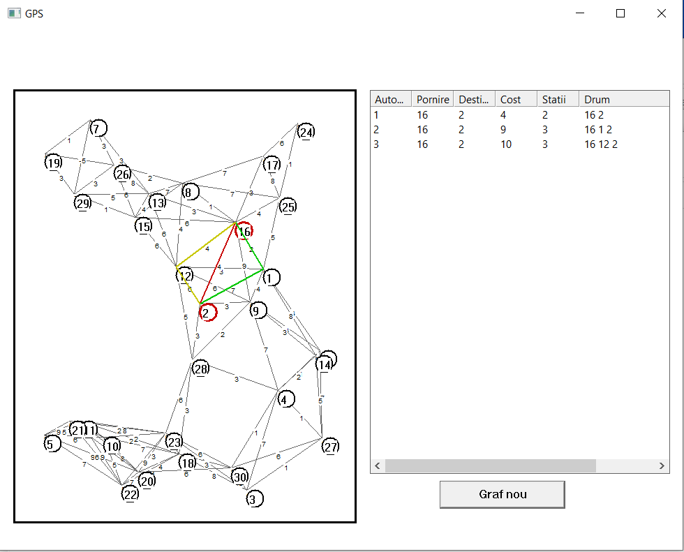

# MiniGPS
A MiniGPS application

The Mini-GPS application is based on the Dijkstra's algorithm. The project illustrates a simple GPS model for 
displaying 3 different routes between the source and destination. Furhtermore, it produces an offline 
version of a GPS in which there are no real time data on the current coordinates of the driver

  

